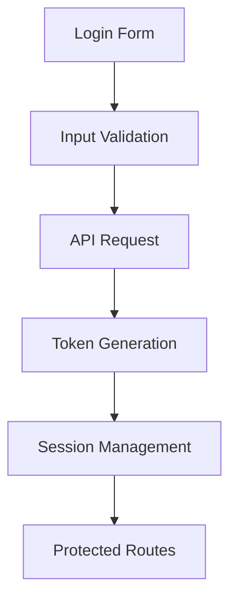

# Systematic Code Review

## 1. Authentication Flow Review

### Security Audit Checklist
- [ ] Password hashing implementation
- [ ] Session management
- [ ] Token handling
- [ ] CSRF protection
- [ ] Rate limiting
- [ ] Input validation
- [ ] Error handling

### Authentication Flow Components


### Critical Areas for Review
1. **Password Management**
   ```typescript
   // Current Implementation Review
   interface PasswordUtils {
     hashPassword(password: string): Promise<string>;
     comparePasswords(password: string, hash: string): Promise<boolean>;
     validatePasswordComplexity(password: string): {
       isValid: boolean;
       errors: string[];
     };
   }
   ```

2. **Token Management**
   ```typescript
   // Token Service Review
   interface TokenService {
     generateToken(payload: UserPayload): string;
     verifyToken(token: string): UserPayload | null;
     refreshToken(token: string): string;
     revokeToken(token: string): void;
   }
   ```

3. **Session Handling**
   ```typescript
   // Session Management Review
   interface SessionManager {
     create(user: User): Session;
     validate(sessionId: string): boolean;
     refresh(sessionId: string): Session;
     destroy(sessionId: string): void;
     cleanup(): void;
   }
   ```

## 2. Performance Analysis

### Performance Metrics
- [ ] Initial page load time
- [ ] Time to interactive
- [ ] API response times
- [ ] Component render times
- [ ] Memory usage
- [ ] Bundle size

### Performance Bottlenecks
1. **Component Rendering**
   ```typescript
   // Performance Monitoring Implementation
   const PerformanceMonitor = {
     measureRender: (componentName: string) => {
       performance.mark(`${componentName}-start`);
       return () => {
         performance.mark(`${componentName}-end`);
         performance.measure(
           `${componentName}-render`,
           `${componentName}-start`,
           `${componentName}-end`
         );
       };
     },
     
     getMetrics: () => ({
       FCP: performance.getEntriesByName('first-contentful-paint')[0]?.startTime,
       LCP: performance.getEntriesByName('largest-contentful-paint')[0]?.startTime,
       FID: performance.getEntriesByName('first-input-delay')[0]?.duration,
       CLS: performance.getEntriesByName('cumulative-layout-shift')[0]?.value
     })
   };
   ```

2. **API Performance**
   ```typescript
   // API Performance Tracking
   const APIMetrics = {
     trackEndpoint: async (endpoint: string, method: string, fn: () => Promise<any>) => {
       const start = performance.now();
       try {
         const result = await fn();
         const duration = performance.now() - start;
         
         // Log metrics
         console.info(`API ${method} ${endpoint}: ${duration}ms`);
         return result;
       } catch (error) {
         const duration = performance.now() - start;
         console.error(`API ${method} ${endpoint} failed: ${duration}ms`);
         throw error;
       }
     }
   };
   ```

## 3. Component Structure Analysis

### Component Architecture Review
- [ ] Component hierarchy
- [ ] Props drilling
- [ ] State management
- [ ] Component reusability
- [ ] Error boundaries
- [ ] Loading states

### Component Best Practices
1. **Component Structure**
   ```typescript
   // Component Template Review
   interface ComponentStructure {
     props: {
       required: boolean;
       optional?: string;
       children?: React.ReactNode;
       onAction: (data: any) => void;
     };
     state: {
       loading: boolean;
       error: Error | null;
       data: any;
     };
     lifecycle: {
       mount: () => void;
       unmount: () => void;
       update: (prevProps: Props) => void;
     };
   }
   ```

2. **Error Boundaries**
   ```typescript
   // Error Boundary Implementation
   class ErrorBoundary extends React.Component<Props, State> {
     state = { hasError: false, error: null };
     
     static getDerivedStateFromError(error: Error) {
       return { hasError: true, error };
     }
     
     componentDidCatch(error: Error, info: React.ErrorInfo) {
       console.error('Error caught by boundary:', error, info);
     }
     
     render() {
       if (this.state.hasError) {
         return <ErrorFallback error={this.state.error} />;
       }
       return this.props.children;
     }
   }
   ```

## 4. API Integration Patterns

### API Layer Review
- [ ] Request/response handling
- [ ] Error handling
- [ ] Data transformation
- [ ] Caching strategy
- [ ] Retry logic
- [ ] Type safety

### API Integration Patterns
1. **API Client Structure**
   ```typescript
   // API Client Implementation
   class APIClient {
     private baseURL: string;
     private timeout: number;
     
     constructor(config: APIConfig) {
       this.baseURL = config.baseURL;
       this.timeout = config.timeout;
     }
     
     async request<T>({
       endpoint,
       method,
       data,
       headers
     }: RequestConfig): Promise<T> {
       try {
         const response = await fetch(`${this.baseURL}${endpoint}`, {
           method,
           headers: {
             'Content-Type': 'application/json',
             ...headers
           },
           body: data ? JSON.stringify(data) : undefined
         });
         
         if (!response.ok) {
           throw new APIError(response.statusText, response.status);
         }
         
         return response.json();
       } catch (error) {
         this.handleError(error);
         throw error;
       }
     }
     
     private handleError(error: unknown) {
       // Error handling logic
     }
   }
   ```

2. **Data Transformation Layer**
   ```typescript
   // Data Transformation
   interface DataTransformer<T, R> {
     transform(data: T): R;
     reverseTransform(data: R): T;
   }
   
   class APIResponseTransformer implements DataTransformer<APIResponse, UIModel> {
     transform(response: APIResponse): UIModel {
       // Transform API response to UI model
     }
     
     reverseTransform(model: UIModel): APIResponse {
       // Transform UI model to API response
     }
   }
   ```

## Implementation Plan

### Immediate Actions
1. **Authentication**
   - Review password hashing implementation
   - Audit token management
   - Implement rate limiting
   - Add CSRF protection

2. **Performance**
   - Implement performance monitoring
   - Add API metrics tracking
   - Optimize bundle size
   - Add caching layer

3. **Component Structure**
   - Implement error boundaries
   - Add loading states
   - Review prop drilling
   - Optimize re-renders

4. **API Integration**
   - Implement consistent error handling
   - Add retry logic
   - Implement caching strategy
   - Add type safety

### Monitoring and Metrics
```typescript
// Monitoring Implementation
const SystemMonitor = {
  auth: {
    trackLogin: (success: boolean, duration: number) => {
      // Track authentication metrics
    },
    trackTokenRefresh: (success: boolean, duration: number) => {
      // Track token refresh metrics
    }
  },
  
  performance: {
    trackPageLoad: () => {
      // Track page load metrics
    },
    trackApiCall: (endpoint: string, duration: number) => {
      // Track API performance
    }
  },
  
  errors: {
    trackError: (error: Error, context: string) => {
      // Track error occurrences
    },
    trackWarning: (message: string, context: string) => {
      // Track warnings
    }
  }
};
```

### Review Schedule
1. **Week 1**: Authentication Flow
   - Password management
   - Session handling
   - Security audit

2. **Week 2**: Performance
   - Component rendering
   - API response times
   - Bundle optimization

3. **Week 3**: Component Structure
   - Component hierarchy
   - State management
   - Error handling

4. **Week 4**: API Integration
   - Request/response patterns
   - Error handling
   - Data transformation

## Contact Information
- Security Lead: security@faithtech-blueprint.com
- Performance Lead: performance@faithtech-blueprint.com
- Frontend Lead: frontend@faithtech-blueprint.com
- Backend Lead: backend@faithtech-blueprint.com 